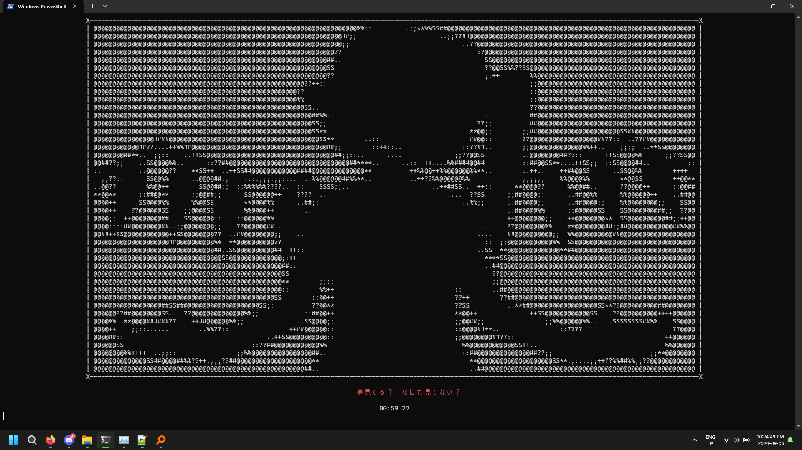

# Bad Apple!!
[Bad Apple!!](https://youtu.be/FtutLA63Cp8) rendered on the terminal using Python, with synced lyrics. Runs on Python 3.11.5, 64-bit.  
Yes, [two exclamation marks](https://www.reddit.com/r/japan/comments/6u5evk/how_come_double_exclamation_marks_are_so_common).  
You may have seen or heard about people rendering the video on esoteric medium choices. You can view some examples of it [here](https://www.youtube.com/playlist?list=PLrjpwekK1wIAhdAOTmRyAryvpm45MutRu).  
Technically, this can render any YouTube video, just don't expect it to work without minor issues.  
I listened to the song for [God knows](https://youtu.be/WWB01IuMvzA) how many times while debugging this crap.

# Installation
1. Download the code, put it wherever you want.
2. Create a [virtual environment](https://realpython.com/python-virtual-environments-a-primer) in the same location.
3. Activate the environment, and type `pip install -r requirements.txt`.
4. Install [yt-dlp](https://youtu.be/5aYwU4nj5QA). Make sure to put it on `PATH`.
4. Install [FFMPEG](https://youtu.be/jZLqNocSQDM). Also put it on `PATH`.
5. Run the program by typing `py bad_apple.py` or `python bad_apple.py` in the terminal.
6. Wait for it to finish downloading assets, and Touhou magic will now render on the terminal.
7. Press `CTRL + C` to stop the program from running.
8. If something goes wrong, you can delete the `cache` folder, and it will start downloading the assets again.

# Preview
[Sample run (flashing lights warning)](https://youtu.be/yGg9V651lwg) **(OLD)**  
Taskbar should be hidden, but nevermind that. Lyrics shown below are hilariously out of sync. Trying to get screenshots while running this thing is what caused the delay.

# Extra links
* [Wikipedia article on Touhou Project (the series where this is derived from)](https://en.wikipedia.org/wiki/Touhou_Project)
* [Wikipedia article on Bad Apple!!](https://en.wikipedia.org/wiki/Bad_Apple!!)
* [Bad Apple!! - ZUN](https://youtu.be/Yw5HTeT_dis)
* [Original upload from ニコニコ](https://www.nicovideo.jp/watch/sm8628149)
* [Some user asking to animate this storyboard that they made, which then spawned the iconic video](https://www.nicovideo.jp/watch/nm3601701)

# Issues
- [ ] Audio out of sync?
- [ ] Excessive flickering of text in the terminal. (seizure warning?)
- [ ] Automatically compute FPS instead of inserting arbitrary magic numbers.

> [!TIP]
> "All weeaboo programmers must write a Bad Apple!! program at least once in their lives." - 宮崎駿
<!--全てウィアブープログラマーは生涯にBad Apple!!的なプログラムを絶対に作るよ。-->
<!-- "Anime was a fucking mistake." - 宮崎駿 -->